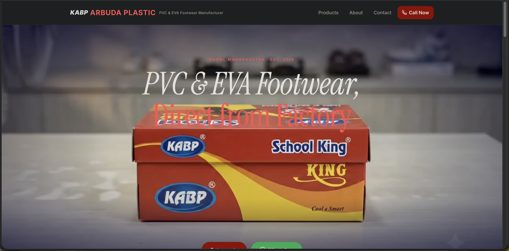

# Arbuda Plastic

Official website for **Arbuda Plastic (KABP)** — a PVC & EVA footwear manufacturer based in Vasai East, Maharashtra, established in 2014.

**Live site:** [arbudaplastic.co.in](https://www.arbudaplastic.co.in/)



## About

Arbuda Plastic manufactures and wholesales PVC and EVA footwear — slippers, sandals, and school shoes — direct from its own factory. The site serves wholesale distributors, retailers, OEM buyers, and export agents sourcing footwear in bulk across India.

## What the site does

- **Product catalog** — 40+ styles across PVC and EVA footwear, organized for quick scanning by a B2B buyer
- **Lead capture** — phone, WhatsApp (pre-filled message), and email, visible at every scroll depth
- **Trust signals** — founding year, full factory address, IndiaMART and Facebook presence, warranty/return policy
- **No cart, no checkout** — by design. The product is the enquiry, not a transaction

## Tech

- Vanilla HTML/CSS/JS — no framework, no bundler, no npm dependencies
- Hosted on GitHub Pages with a custom domain (`CNAME`)
- WebP images with lazy-loading below the fold; hero preloaded for LCP
- JSON-LD `Manufacturer` structured data, Open Graph tags, single-H1 hierarchy
- Hardened security headers: CSP (no `unsafe-eval`), HSTS, X-Frame-Options `DENY`, `nosniff`, strict `Referrer-Policy`
- WCAG AA target — focus rings, ARIA landmarks, 44px minimum touch targets, reduced-motion support

## Design principles

Built for a wholesale buyer scanning for a supplier, not a retail shopper browsing a brand. Direct, plain-spoken copy. Credibility over decoration. Optimized for 4G Indian mobile connections — no heavy dependencies.

## Structure

```
index.html          Homepage — hero, product highlights, trust signals, contact
products.html        Full product catalog
Products/             Product images
assets/               Static assets, scripts
CNAME                 Custom domain config for GitHub Pages
```

## Status

Live and stable. Maintained on an as-needed basis.

## License

All rights reserved. See [LICENSE](LICENSE).

---

© Arbuda Plastic. All rights reserved.
